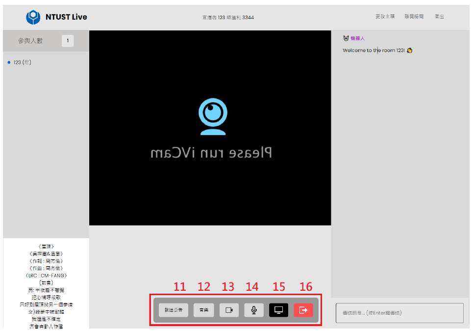
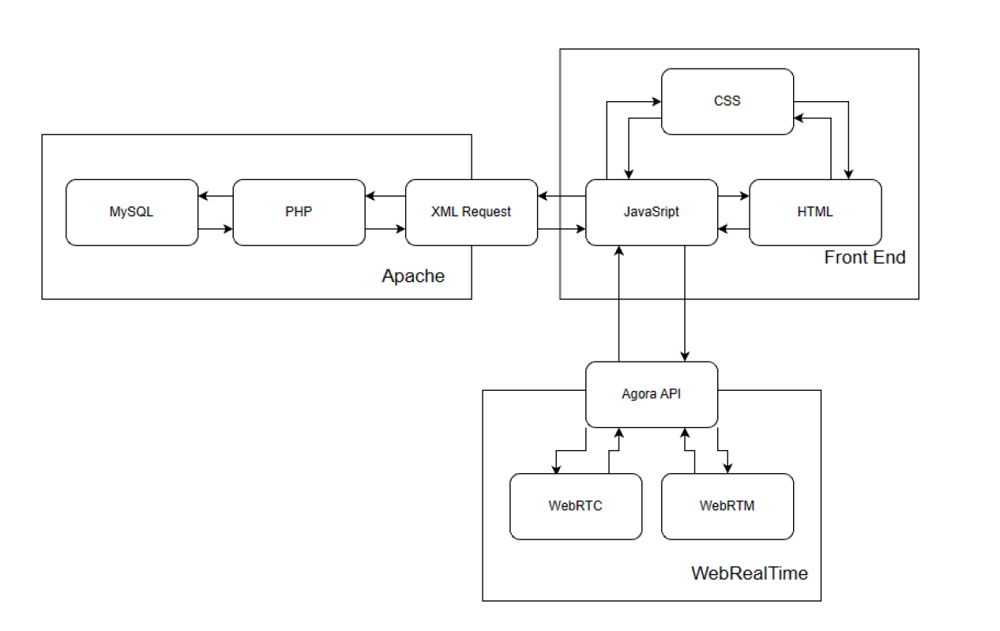
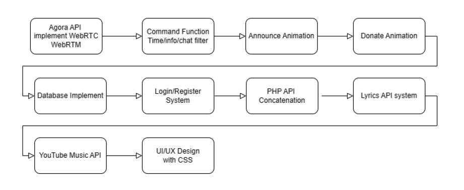
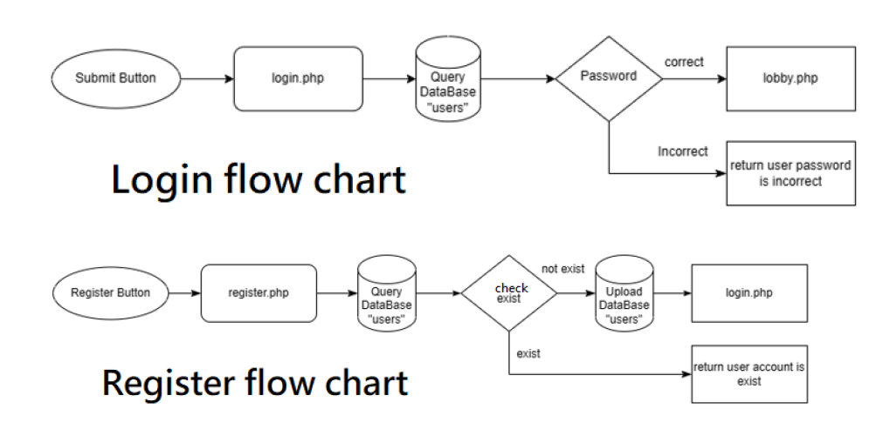

# Live streaming

This project is a live streaming platform that allows users to create and join rooms, interact with other users, and enjoy a variety of features such as chatrooms, music systems, and synchronized lyrics. The project is built using the Agora API, Rabbit Lyrics, and Azure Function, and is deployed using Docker Compose. The project is designed to be user-friendly and easy to set up, with a focus on providing a seamless and enjoyable experience for users.

## stream screenshot



## Architecture


## Implementation flowchart


## Regist flowchart


## Features

1. Display Online Members: By utilizing the Agora API, you can retrieve the number of online members in the room using the following JavaScript code: `let members = await channel.getMembers()`. This information can be displayed on the interface.

2. Display Participant Accounts: Upon login, user accounts are stored. This enables tracking of participants entering and leaving the livestream room, displaying their accounts and roles (such as host, self, or other audience members), and managing them accordingly.

3. Lyrics System: Utilizing the Rabbit Lyrics system, you can display synchronized lyrics animations by placing LRC lyric format within a `<div>` in HTML, adding the class "rabbit-lyrics lyrics" and binding it to the corresponding Audio Player using `data-media="#audio-1"`.

4. Real-time Host Status: The system periodically checks the room's database every 2 seconds to determine if there is a live host. If there is no host, it displays "No live host currently, please wait for the host to join!". If there is a host, it displays the host's name and total revenue. Refer to the flowchart for the process.

5. Livestream Interface: The livestream interface is displayed when a host or authorized audience member starts a livestream. This is achieved by calling the Agora API. Refer to the code snippet for creating and broadcasting the livestream.

6. Room Settings: Changing the theme adjusts the interface to dark or light mode. Exiting the room returns to the lobby to join other rooms. Logging out returns to the login page.

7. Chatroom and Command Input: The chatroom has two main roles: bot and participants. The bot manages command replies, and participant login and logout notifications. The chatroom supports two main functionalities:
   I. Automatic filtering of inappropriate language entered by participants.
   II. User commands: Messages starting with an exclamation mark are considered commands. Current commands include:
       - !help: Query all commands
       - !info: Display list of creators
       - !time: Display total live time
       - !music: System command

   7-1. Music System: Utilizing the YTDL-Core API implemented in Azure Function, the system can play YouTube songs through the Audio Player. Audience can request permission to play music. Available commands include:
       - !music help: Query music system commands
       - !music apply: Request permission for music bot
       - !music play [URL]: Play YouTube music
       - !music pause: Pause music playback
       - !music resume: Resume music playback
       - !music skip: Skip current music
       - !music now: Query currently playing music
       - !music list: Query all music in playlist

8. Text Input Box: Enter messages or commands here. Press Enter to send and display responses or conversations in the chatroom.

9. Donation System: Viewers can support the host by donating. Clicking the donation button prompts an input box for the donation amount. JavaScript verifies if it's a valid number and updates the donation amount in the database, displaying an animation on everyone's screen.

10. Join Livestream Request: Viewers can interact with the host by sending requests through this button, which sends a Channel Message to the host. Upon receiving a request, a dialog box appears for the host to accept or decline.

11. Announcement System: Hosts can send announcements by typing in the dialogue box, which sends a Channel Message to all participants, displaying a scrolling marquee announcement on everyone's screen.

12. Play Specified Music: This button plays the specified music "屋頂" in everyone's livestream, synchronizing with the lyrics system for singing along.

13. Webcam Toggle: Hosts can temporarily disable their webcam during the livestream by clicking this button, displaying a logo and background animation. Clicking again re-enables the webcam.

14. Microphone Toggle: Hosts can temporarily mute their microphone during the livestream by clicking this button. Clicking again unmutes the microphone.

15. Screen Livestream: If the host is streaming from a computer, they can livestream their computer's application windows or the entire screen, broadcasting it to everyone. This is achieved using `await AgoraRTC.createScreenVideoTrack()` from the Agora API to capture the computer screen.

16. Close Livestream: Hosts can close the livestream by clicking this button, stopping video and audio playback. Clicking again allows them to join the livestream again.


# Quick Setup

## HTTPS, DNS

1. **Update Software and Install Certbot Dependencies:**
    ```
    $ sudo apt update
    $ sudo apt install certbot python3-certbot-apache
    ```

2. **Run Certbot and Enter Domain Name and Basic Information to Automatically Install:**
    ```
    $ sudo certbot –apache
    ```

## Docker Container Deployment

This configuration is set up for php:7.3.3-apache and generates self-signed certificates using "OpenSSL".

1. **Generate Self-signed Certificates with OpenSSL:**
    ```
    $ openssl req -x509 -nodes -days 365 -newkey rsa:2048 -keyout server.key -out server.crt
    ```

2. **Command to Activate Docker Compose (using .env file), -d flag runs docker in the background:**
    ```
    $ docker-compose –env-file .env up -d
    ```

3. **To Stop Container Execution and Delete All Containers, Enter the Following Command:**
    ```
    $ docker-compose –env-file .env down
    ```

By utilizing the provided files in this project, you can easily set up a LAMP architecture website. To remove Docker, please ensure to modify the .env environment configuration file with the following details: file path (must be a complete path), database password, and PORT.
